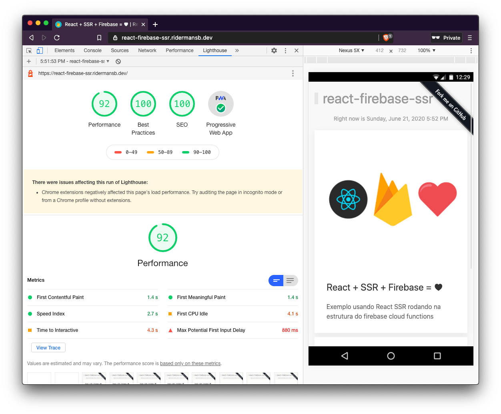

<a href="https://gitpod.io/#Ridermansb/react-firebase-ssr">
  
</a>

> React template with SSR by using Firebase Cloud Functions

<p align="center">
    
</p>

**Seel the deference bellow**

 * SSR Live: https://react-firebase-ssr.ridermansb.dev/
 * CSR Live: https://react-firebase-nossr.ridermansb.dev/

### Pre-requisites

Make sure you have [`firebase-tools`][firebase-tools] installed

**Install all dependencies**
```
npm i
cd functions/ 
npm i
```

## Get Starter

`npm start` will start webpack-dev-server on port 7003


### Run with firebase server

Build the app to generate `client.html`

```
rm -rf public && PUBLIC_PATH=http://0.0.0.0:5000 npmR build -- --watch
```

> PUBLIC_PATH is the hosting URL generated by firebase server

Inside `functions` folder, run webpack in watch mode

```
rm -rf dist/ && npmR build -- --watch 
```

Start the server

```
npmR start:serve -- --host 0.0.0.0
```

### Run with firebase emulators

Build the app to generate `client.html`

```
rm -rf public && PUBLIC_PATH=http://0.0.0.0:8000 npmR build -- --watch
```

> PUBLIC_PATH is the hosting URL, check firebase.json file

Inside `functions` folder, run webpack in watch mode

```
rm -rf dist/ && NODE_ENV=production npmR build -- --watch 
```

Start the emulators

```
npmR start:emulators
```

---------

## Tools

Tools that can help you in some way

### Performance

 * > [prerender.io][4]   
   > Allows your Javascript website to be crawled perfectly by search engines.
 * > [react-snap][5]
   > Pre-renders a web app into static HTML. Uses Headless Chrome to crawl all available links starting from the root.
 * > [pagespeed][pagespeed]
   > Test your page in all devices
 * > [snyk][snyk]
   > Enabling more than 400,000 developers to continuously find and fix vulnerabilities in open source libraries and containers
 * > [pingdom.com][pingdom.com]
   > Enter a URL to test the page load time, analyze it, and find bottlenecks.
 * > [Codeball.ai](https://codeball.ai/)
   > Approve PRs using AI.

### Great tools for SEO

 * [schema-markup-generator][1] or [json-ld-generator][json-ld-generator]
 * [seositecheckup.com][seositecheckup]
 * [rich-results][rich-results] or [structured-data][structured-data]
 * [facebook-og-debug][facebook-og-debug]
 * [linkedin-post-inspector][linkedin-post-inspector]
 * [twitter-card-validator][twitter-card-validator]
 * [smallseotools][smallseotools]


### Other tools

 * [best-marketing-tools][best-marketing-tools]
 * [search-console][search-console]

[1]: https://technicalseo.com/tools/schema-markup-generator/
[json-ld-generator]: https://webcode.tools/json-ld-generator
[best-marketing-tools]: https://saijogeorge.com/best-marketing-tools/
[4]: https://prerender.io/
[5]: https://github.com/stereobooster/react-snap
[firebase-tools]: https://firebase.google.com/docs/cli
[search-console]: https://search.google.com/search-console
[seositecheckup]: https://seositecheckup.com/
[pagespeed]: https://developers.google.com/speed/pagespeed/insights/
[rich-results]: https://search.google.com/test/rich-results?utm_campaign=devsite&utm_medium=jsonld&utm_source=recipe
[structured-data]: https://search.google.com/structured-data/testing-tool
[facebook-og-debug]: https://developers.facebook.com/tools/debug/
[smallseotools]: https://smallseotools.com/
[linkedin-post-inspector]: https://www.linkedin.com/post-inspector/
[twitter-card-validator]: https://cards-dev.twitter.com/validator
[data-highlighter]: https://www.google.com/webmasters/data-highlighter/u/0/tagger?sourceId=106074205&hl=en
[markup-helper]: https://www.google.com/webmasters/markup-helper/u/0/tagger?sourceId=106075397
[snyk]: https://snyk.io/
[pingdom.com]: https://tools.pingdom.com/#5cb726db5c800000

